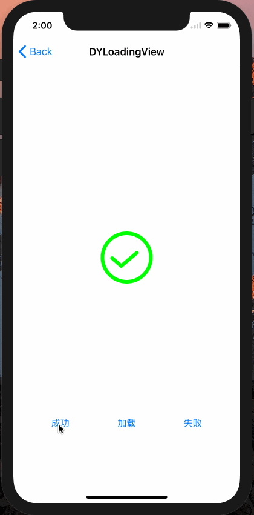

# iOS_Utils
> 本仓库是本人在工作过程中总结工具库，使用swift编写的iOS的工具库。还在继续完善， 希望大家支持一下给个star

## WebViewController
> 对WKWebView 的封装 简单易用 :+1

实列：
`let _ = WebViewController.open("http://www.baidu.com", title: "test WebViewController")`

## DYLoadingView
> 加载动画

<div align=center>

</div>

实列：

```
let loadingView = DYLoadingView()
loadingView.show(in: self.view, isCenter: true, loadType: .loading)
```